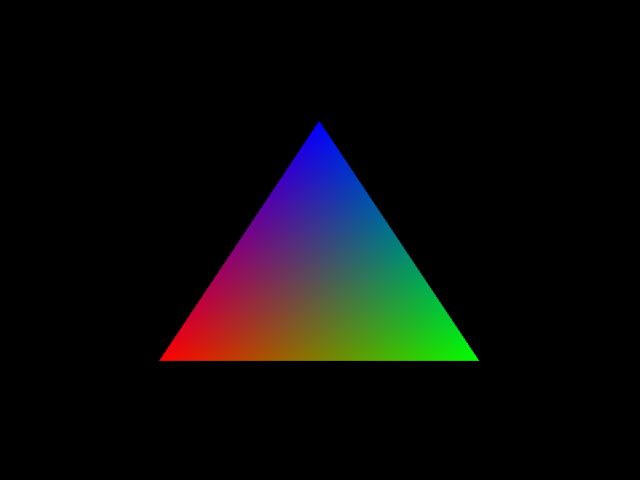
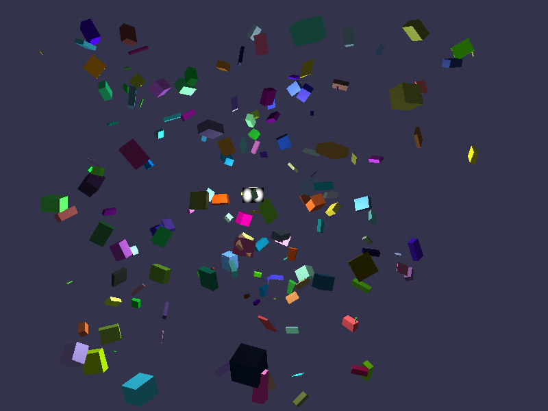
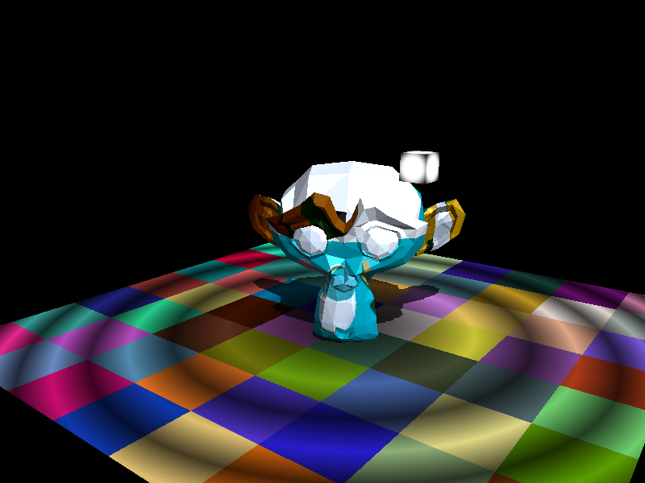

# Software renderer.

A simple real-time 3D software renderer.

<p align="center">
 
</p>

<p align="center">
 
</p>

<p align="center">
 
</p>

## Table of contents
* [Purpose](#purpose)
* [Features](#features)
* [Technologies](#technologies)
* [Setup](#setup)
* [Usage](#usage)
* [Project Status](#project-status)
* [Room for Improvement](#room-for-improvement)


## Purpose
This project with the purpose of learning the algorithms behind 3D raster graphics based on the [tiny renderer](https://github.com/ssloy/tinyrenderer "tiny-renderer") by [Dmitry V. Sokolov](https://github.com/ssloy "tiny-renderer"), as well as demystifying certain aspects of OpenGL for myself. In contrast to the tiny renderer, I chose to also use OpenGL by copying the colorbuffer's data to a texture buffer and rendering it in real-time, instead of just saving the frames as images on disk, which helped a lot with visual debugging. Also just plain old interest in how I'd go about writing a software renderer, because it's a cool idea for a project.


## Features
- A very basic, incomplete .obj file loader.

- Triangle rasterization.

- Backface culling.

- Lazy wireframes.

- Clipping against the near z-plane in clip space, but not against other planes in order to minimize clipping operations.

- Perspective-correct interpolation.

- Z-buffering with early depth-testing.

- A base shader program class interface trying to mimic the structure of GLSL shader programs (vertex and fragment shaders), as well as some example shaders.

- 3 very simple scenes, including Blinn-Phong shading, texture sampling and (very jaggy) shadow mapping with a directional light.
	

## Technologies
- CMake and C++11.
- [GLFW](https://github.com/glfw/glfw "GLFW") for window creation, OpenGL context creation and input.
- OpenGL 3.3 (Desktop) for rendering the texture on which the software renderer works (optional).
- The [GLAD loader for OpenGL](https://glad.dav1d.de/ "glad") on desktop (OpenGL 3.3 Core Profile) (optional).
- [stb_image](https://github.com/nothings/stb/blob/master/stb_image.h "stb_image") for loading image files.
- [stb_image_write](https://github.com/nothings/stb/blob/master/stb_image_write.h "stb_image_write") for writing image files.
- [My small C++ codebase](https://github.com/io-kats/ersatz "ersatz").


## Setup
- For Windows you are going to need CMake (3.20.0-rc2 on my system) and:
use Visual Studio Code with the [CMake Tools extention](https://marketplace.visualstudio.com/items?itemName=ms-vscode.cmake-tools&ssr=false#overview "cmake_tools") for desktop to build the project. 
Tested with the Microsoft Visual Studio Community 2019 - Version 16.7.5 (x64) compiler.
- If you'd like a a web version, install the Emscripten compiler toolchain, go to wherever you cloned the repo
and run in the Emscripten command prompt:

```
$ cd ../3d-gallery
$ mkdir build
$ cd build 
$ emcmake cmake .. 
$ emmake make
```

To get a preview of what the app looks like also run in the same folder:

```
$ python -m http.server
```
and visit 
```
localhost:8000/main/software_renderer.html
```

in your browser. 

However this has only been tested on Chrome Version 94.0.4606.81, so it might break on other versions or browsers.

Please look at the [Emscripten tutorial](https://emscripten.org/docs/getting_started/Tutorial.html "emscripten_tutorial") for more information on how the toolchain works.

## Usage
Use the ERS_SHADER_DEFINE_VARYINGS macro to define the names of your varyings and what fields they contain. Make sure it is made up of single precision floating point types, as that's how they will be interpreted. An example program used for "hello triangle":

```
#include "window.h"
#include "software_renderer.h"
#include "gl_surface.h"
#include "shader_program.h"
#include "ers/typedefs.h"
#include "ers/vec.h"

// Some example layouts for vertex attributes can be found in the "shader_program.h" header file.
struct VertexAttributes
{       
    ers::vec3 aPos;
    ers::vec3 aColor;
};

class SimpleShader : public IShaderProgram
{

ERS_SHADER_DEFINE_VARYINGS(m_vars, m_varsInterpolated, { ers::vec3 color; })

public:
    void VertexShader(
        const void* in0, const void* in1, const void* in2,
        ers::vec4& p0, ers::vec4& p1, ers::vec4& p2        
    ) override
    {
        p0 = VertexShaderPerVertex(in0, 0);
		p1 = VertexShaderPerVertex(in1, 1);
		p2 = VertexShaderPerVertex(in2, 2);
    }

    ers::vec4 VertexShaderPerVertex(const void* in, s32 which_vert)
    {       
        const VertexAttributes* vert = (const VertexAttributes*)in;
        m_vars[which_vert].color = vert->aColor;		
		const ers::vec4 position = ers::vec4(vert->aPos, 1.0f);       
        return position;
    }

    bool FragmentShader(ers::vec4& out) override
    {        
        out = ers::vec4(m_varsInterpolated.color, 1.0f);     
        return false; // return true if you want to discard a fragment.
    }  
};

class App : public Window
{
private:
	Renderer* m_renderer;

	f32 m_triangle[3][6] = 
	{
		{ -0.5f, -0.5f, 0.0f, 1.0f, 0.0f, 0.0f },
		{ 0.5f, -0.5f, 0.0f, 0.0f, 1.0f, 0.0f },
		{ 0.0f, 0.5f, 0.0f, 0.0f, 0.0f, 1.0f },
	};

	SimpleShader m_simpleShader;

	// Just a texture buffer for rendering the software renderer's render buffer.
	GLSurface m_surface; 

public:
	App(const char* title_, int width_, int height_, int windowpos_x, int windowpos_y)
		: 
		Window(title_, width_, height_, windowpos_x, windowpos_y),
		m_surface(width_, height_)
	{ 
		
	}

	void Init() override
	{		
		m_renderer = new Renderer(GetWindowWidth(), GetWindowHeight());	
	}

	void Update() override
	{			
		if (WindowSizeChanged()) 
		{
			const s32 w = GetWindowWidth();
			const s32 h = GetWindowHeight();
			m_renderer->SetViewport(w, h);
			m_surface.Resize(w, h);
		}

		m_renderer->Clear();

		VertexAttributes v0, v1, v2;
		v0.aPos = ers::vec3(m_triangle[0][0], m_triangle[0][1], m_triangle[0][2]);
		v0.aColor = ers::vec3(m_triangle[0][3], m_triangle[0][4], m_triangle[0][5]);

		v1.aPos = ers::vec3(m_triangle[1][0], m_triangle[1][1], m_triangle[1][2]);
		v1.aColor = ers::vec3(m_triangle[1][3], m_triangle[1][4], m_triangle[1][5]);

		v2.aPos = ers::vec3(m_triangle[2][0], m_triangle[2][1], m_triangle[2][2]);
		v2.aColor = ers::vec3(m_triangle[2][3], m_triangle[2][4], m_triangle[2][5]);
		
		m_renderer->SetShaderProgram(&m_simpleShader);
		m_renderer->RenderTriangle(&v0, &v1, &v2);

		m_surface.Draw(m_renderer->GetColorBuffer());
	}

	void Cleanup() override
	{
		delete m_renderer;
	}
};

int main()
{		
	const s32 w = 800;
	const s32 h = 600;

	App app("Software Renderer", w, h, 200, 200);
	app.Run();
	app.Cleanup();

	return 0;
}
```

Controls for the scenes:
- Press the left and right arrow keys to change the scene.
- The controls for the 3D scenes are as follows:
	- Press WASD for movement.
	- Press C to toggle between FPS and FLY modes for the camera.
	- Hold the left mouse button to change the viewing direction.
	- Press up and down arrow keys to increase or decrease the number of parallepipeds in the parallepipeds scene.
	- Press F to take a screenshot.
	- Press V to toggle the wireframe on and off.
	
If you do not want to render in real-time, you can use the renderer's WriteToFile method and save the rendered scene as an image to disk.

For more details, please take a look at the source code. The 'guts' of this project are in "software_renderer.\*" and "shader_program.\*"


## Project Status
The project is still in development. Even thought the renderer works, many features are still not implemented. It can also get pretty slow in higher resolutions or when a lot of reading from textures is involved.


## Future goals
In the following order:
- Implement alpha blending.
- Implement MSAA.
- Try to get skeletal animations on screen (integrate assimp).
- Parallelize rasterization using SIMD instructions and/or threads.
- Use a tiling strategy for textures (and/or the z-buffer) to e.g. speed up texture lookups in the fragment shader.
- Implement cubemaps.
- Implement the stencil test.
- Allow the user to choose if they want to do the depth test early or not.
- Implement the scissor test.
- Implement guard-band clipping OR full-on clipping on every clip plane.
- After doing all of the above and learning dear imgui, write a dear imgui backend for it as an experiment and see how it performs.
